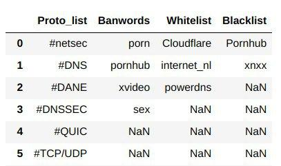

# NaWaB bot
 

## What is it?
This bot is a content curator for the topics related to the networks. Made with python and twitter API, it is the best solution to be updated in the latest technologies, developements and discussion of networks on twitter.

## Features of NaWaB bot
<p align="center">
  
</p>

* The above snapshot shows how the data is structured in data.csv. For the full version, checkout out [here](data.csv).
* Scrapes all the tweets related to networks and retweets. The retweeted public tweets will have at least one among the listed hashtags in the `Proto_list` column of data.csv .
* When running the script, it logs errors, results and the id of the retweeted tweets are stored in data.csv to different columns.

    *  `Blacklist` contains the blacklisted accounts username, whose tweets would be ignored by the bot.
    *  `Banwords`  contains the banned words which again would be ignored by the bot.
    *  `Whitelist` contains the whitelisted acccounts usernames, whose tweets would be tweeted.


## Usage of bot
To start the bot we made, send a `/start` to [@info_nawab_bot](https://t.me/info_nawab_bot). Normal users would only be able to view the tweets.

## Getting Started
* Clone the repository
```
$ git clone https://github.com/Aniketh01/NaWaB.git
```
* Create a virtual environment to install the necessary python packages for this script. For this:

``` 
$ virtualenv -p /usr/bin/python3 <virtualenv name> 
```

* Activate the virtualenv

```
$ source <virtualenv name>/bin/activate
```

* Install all the required packages 
```
$ pip install -r requirements.txt
```

* Make the directory for the log storage
```
$ sudo mkdir /var/log/nawab
```

* Fill the `config.py`
  * The `config.py` is the file for all the necessary tokens of twitter as well as telegram. 
  * For creating the twitter tokens visit [here](https://developer.twitter.com/en/apps/create).
  * For the telegram bot, you must create one. After creating fill the `tg_token` with your bot's token. To create a bot visit [here](https://core.telegram.org/bots#3-how-do-i-create-a-bot).

* Run the script
```
$ python3 nawab.py
```
### CLI Arguments

* The bot provides the user with arguments to input and use. To view all the arguments try:

```console
$ python3 nawab.py -h
usage: nawab.py [-r] [-b BLACKLIST] [-p PATH] [-V] [-s] [-h] [-v]

optional arguments:
  -r, --retweet         Retweet all tweets automatically, doesn't spawn a
                        telegram bot
  -b BLACKLIST, --blacklist BLACKLIST
                        Blacklist the given username
  -p PATH, --path PATH  Path where the log files be stored. Note to create
                        directory in that path beforehand.
  -V, --verbose
  -s, --silent
  -h, --help            Show this help message and exit.
  -v, --version         Show program's version number and exit.

```
### Usage

#### -r --retweet
This argument enables the user to retweet the tweets automatically without use of telegram bot and only the view button will be visible in the bot. Note by default, if the argument is not provided, then both retweet and view button will be visible in the telegram bot from which user can retweet manually. 

example:

```console
$ python3 nawab.py -r
```

#### -b blacklist
This argument when used, enables the user to input the usernames that they want to blacklist. The argument will take a list of usernames.

example:

```console
$ python3 nawab.py -b Macdonalds Agaro23
```
#### -p path
This argument when used, the user could change the path to the directory where they want to store the log files. Note that by default, the log files are store in the /var/log/nawab directory.

example:

```console
$ python3 nawab.py -p /home/user/nawab
```
#### -V --verbose
This argument when used, the logger will change to verbose mode ie; it will print all log messages onto console.

example:

```console
$ python3 nawab.py -V
INFO:05/12/2020 10:55:56 PM 	|starting new query search: 	#netsec
INFO:05/12/2020 10:55:58 PM 	|https://twitter.com/%&^^&^&/status/12****************60
INFO:05/12/2020 10:55:58 PM 	|Id: 12****************60is stored to the db from this iteration 
INFO:05/12/2020 10:55:58 PM 	|starting new query search: 	#DNS
INFO:05/12/2020 10:56:00 PM 	|https://twitter.com/Ho----a/status/12****************90
INFO:05/12/2020 10:56:00 PM 	|Id: 12****************90 is stored to the db from this iteration 
INFO:05/12/2020 10:56:00 PM 	|starting new query search: 	#DANE
INFO:05/12/2020 10:56:01 PM 	|https://twitter.com/b^%^%an/status/12****************29
INFO:05/12/2020 10:56:01 PM 	|Id: 12****************29 is stored to the db from this iteration 
INFO:05/12/2020 10:56:01 PM 	|starting new query search: 	#DNSSEC
INFO:05/12/2020 10:56:03 PM 	|https://twitter.com/om$%$t/status/12****************76
INFO:05/12/2020 10:56:03 PM 	|Id: 12****************76 is stored to the db from this iteration 
INFO:05/12/2020 10:56:03 PM 	|starting new query search: 	#QUIC

```
#### -s --silent
This argument when used, the logger will change to silent mode ie; it will not print any log message onto console.Note by default only error and warning messages gets logged to console.

example:

```console
$ python3 nawab.py -s

```

#### Argument type 

| Parameter                 | Default/value |    
| :------------------------ |:-------------:|
| -r --retweet 	            |	  boolean     |
|-b  --blacklist            | list          |
| -p --path	                |	  string      |
| -V, --verbose 		        | 20(integer)	          | 
| -s, --silent		          | 50(integer)           |
| -h, --help	              |               | 
|  -v, --version 	          |               | 

## Developers 
1. [Aniketh Girish](https://github.com/Aniketh01/)
2. [K N Anantha nandanan](https://github.com/ananthanandanan)
3. [Akshay Praveen Nair](https://github.com/iammarco11/)

## Want to contribute?
Take a look at the issues listed [here](https://github.com/Aniketh01/NaWaB/issues)
